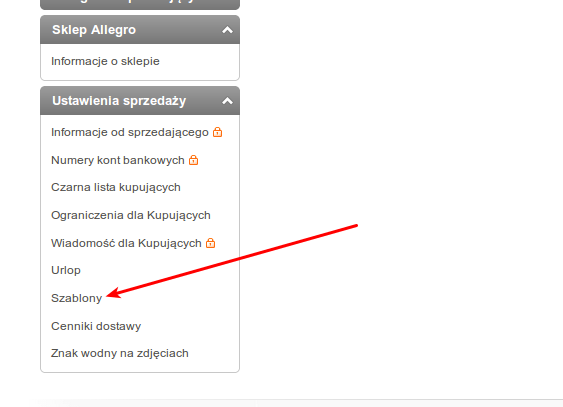
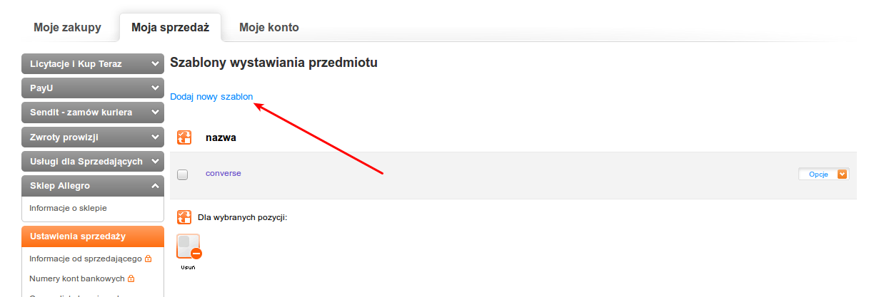
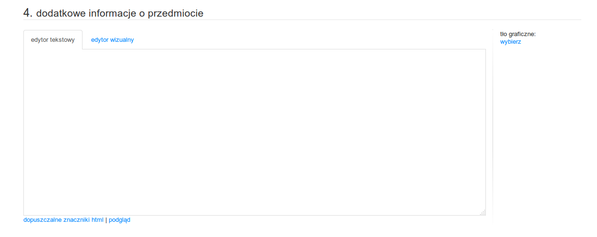
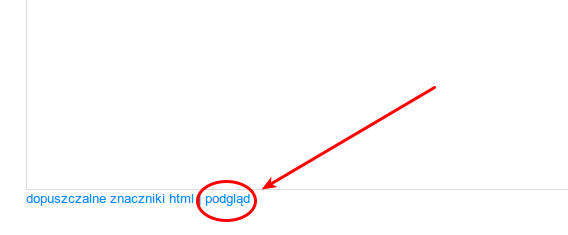

# css4allegropl
Skeleton i normalize.css przystosowane do pracy z szablonami Allegro.pl

## Czemu
Lubię, gdy nawet te pozornie najnudzniesze i bezsensowe zadania prowadzą do czegoś kreatywnego. Tym razem zaimplementowałem w szablonach allegro system gridów Skeletona.

Dzięki temu strona aukcji będzie wyglądała dobrze zarówno na telefonach, jak i tabletach. Coś co często mi doskwiera, gdy chcę coś na allegro sprawdzić lub kupić będąc w drodze. 

Mam nadzieję, że publikacja tego kodu - sposobu, podniesie trochę jakość aukcji. Podczas gdy jakość stron w sieci znacznie się podnosi, aukcje allegor niezmiennie kuleją. 

## Jak korzystać

Po zalogowaniu w serwisie [Allegro](http://allegro.pl) przechodzimy do sekcji *moje allegro*. Tam w ustawieniach sprzedaży przechodzimy do szablonów:

Klikamy w *dodaj nowy szablon*:

Po wyłenieniu formularza według naszych potrzeb na samym jego dole znajdziemy pole, które wypełniamy naszym kodem:

Tam możemy wkleić zawartość pliku sample.html i rozpocząć jego dalsze uzupełnianie kodem HTML. Dzięki wklejonemu kodowi CSS wstawiane przez nas elementy od razu będą całkiem nieźle wyglądały. Przykładowy plik przewiduje również sekcję na własny kod CSS, którą wypełniamy naszym opisem wyglądu wstawianych elementów. 

Przydatnym podczas pracy narzędziem jest podgląd. 

Kliknięcie tego przycisku spowoduje otwarcie nowego okna, z podglądem widoku naszej aukcji. 

## Linki

Całość wykorzystuje kod projektów [Skeleton](https://github.com/dhg/Skeleton) oraz [normalize.css](https://github.com/necolas/normalize.css/). 